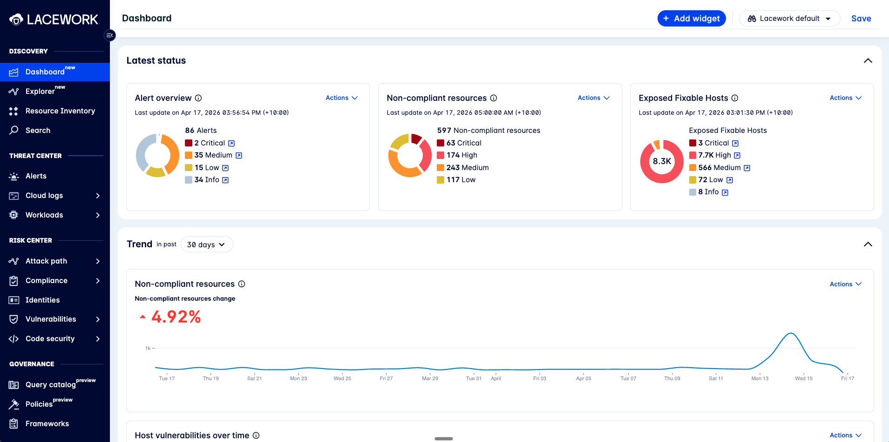
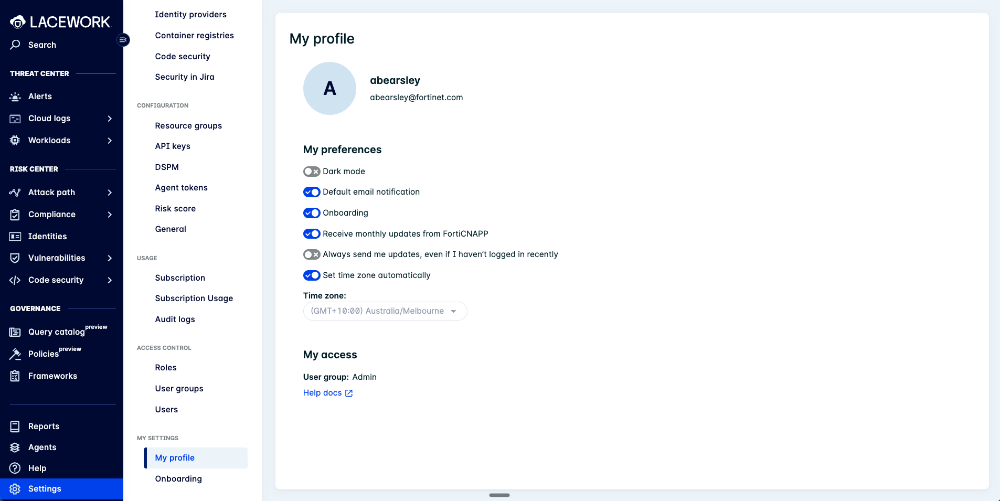
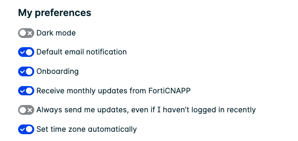
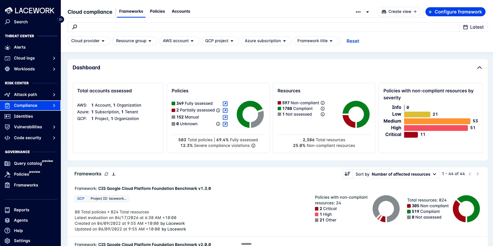
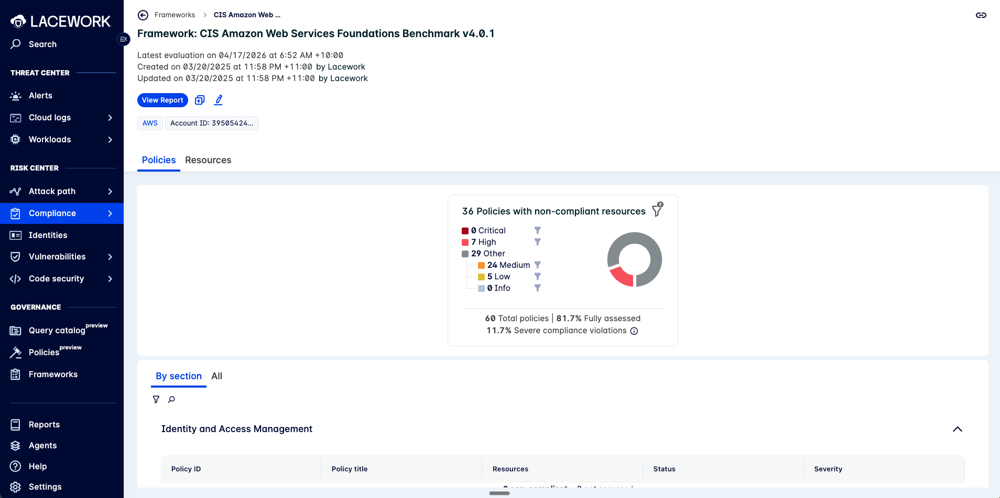
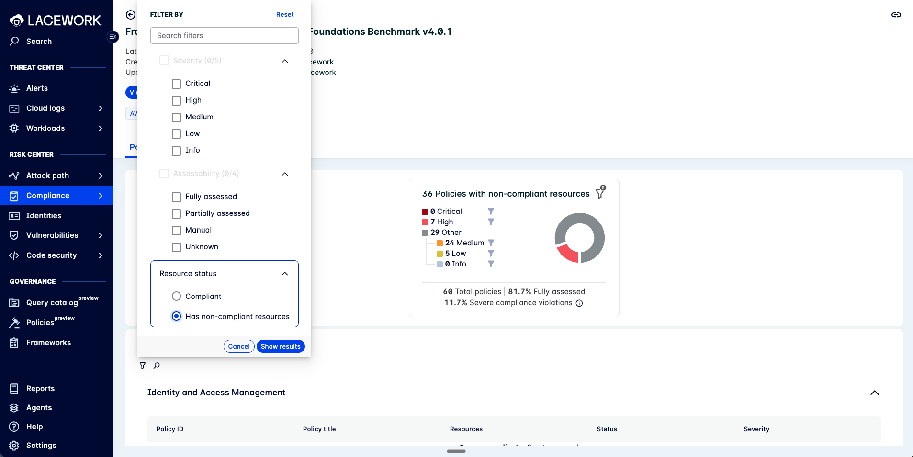
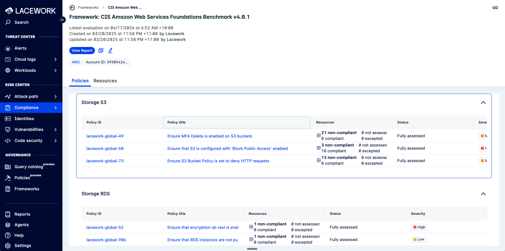
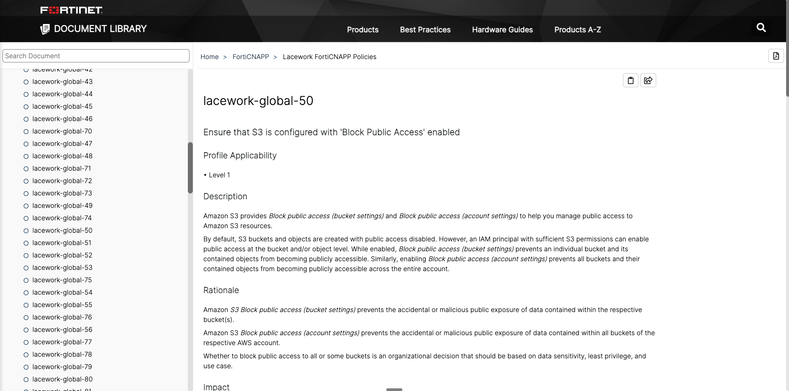
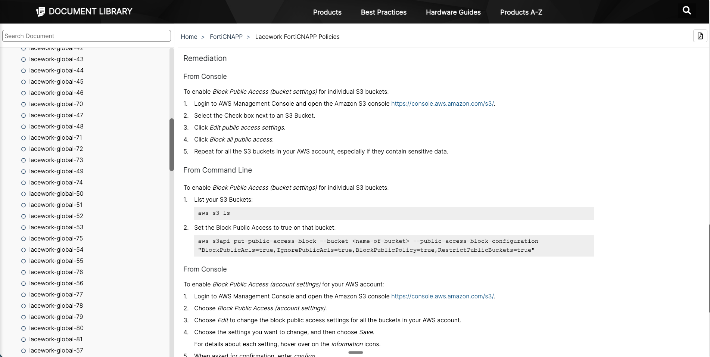

# FortiCNAPP Training for Service Owners: Compliance Self-Service

A ~20-minute training video for technical service owners who receive compliance alerts and need to action them in FortiCNAPP.

## Audience

Service owners who own AWS, Azure, or GCP resources and have received a compliance notification.

## Outcomes

By the end of this training you will be able to:

1. Log in to FortiCNAPP and set your notification preferences
2. Find the non-compliant resources you own in the Compliance section
3. Read a violation and follow the remediation instructions
4. Create an exception for a single resource
5. Create an exception that covers multiple resources by tag

## Format notes (for the video producer, not shown on screen)

- Each section has a **Slide**, an **image** (embedded screenshot, or a broken-image placeholder with alt text if not yet captured), a **Talk track** (spoken verbatim), and **Presenter notes** (commentary, not spoken)
- Screenshots to be captured from your FortiCNAPP tenant with representative (non-sensitive) data
- Run time target: 20 minutes. Talk track totals ~2,600 words at ~130 wpm
- Keep cursor movements slow and deliberate. The audience is watching the screen, not just listening

---

## Section 1: Welcome and what you'll learn (~1 min)

### Slide: Title card

### Talk track

> Hi, and welcome. This short training is for anyone who owns a cloud resource (an S3 bucket, a VM, a database, a subscription) and has received a compliance notification email from the Cyber Security team.
>
> These emails tell you that one of your resources isn't meeting an organisational security standard. In the next twenty minutes, I'll show you exactly what to do about it. We'll cover four things: logging in and setting your notification email, finding your resource, following the remediation instructions, and, for the cases where you can't or shouldn't remediate right now, creating an exception.
>
> Nothing here is complicated. By the end you'll be able to self-serve, without needing to open a ticket.

### Presenter notes

- Keep energy conversational. This is for people who didn't ask for this training
- Emphasise self-service so they know the goal is to unblock them

---

## Section 2: Logging in (~1 min)

### Slide: Accessing FortiCNAPP

### Talk track

> Let's start by getting into the console. Your organisation's FortiCNAPP URL has been shared with you in the notification email. I'd recommend bookmarking it now.
>
> You'll sign in with your organisation's single sign-on credentials the same way you sign in to anything else, so I'm not going to walk through that part. If you can't log in, that's a ticket for IT, not something we cover here.
>
> Once you're in, this is what you'll see: the main dashboard. What you see here depends on your access. Some people see the whole environment, others only see the accounts and resources their team owns. Either way, we're going to drill straight down to just your resources in a moment.

### Presenter notes

- Do NOT record the SSO flow. Just jump-cut from the URL bar to the post-login dashboard

---

## Section 3: Setting your user preferences (~2 min)

### Slide: Finding your profile

### Talk track

> First let's set you up. In the left-hand navigation, scroll to the bottom, click **Settings**, then in the Settings sub-menu go to **My settings > My profile**.
>
> You'll see your name and email at the top. Below that is a section called **My preferences**, and this is where most people will want to make a couple of changes.

### Slide: Preferences to change

### Talk track (continued)

> Four toggles matter.
>
> **Dark mode.** Your call. Turn it on if you prefer dark, leave it off for light. No right answer.
>
> **Default email notification.** Most people turn this one off. It controls the generic default notifications FortiCNAPP sends directly to you. The compliance emails you're getting from the Cyber Security team come through a separate pipeline and aren't affected by this toggle, so switching it off cuts noise without losing the emails that matter.
>
> **Onboarding.** Also turn this off. It drives the in-app onboarding prompts that are only useful the first time you log in.
>
> **Receive monthly updates from FortiCNAPP.** This is the vendor's monthly product-news email. Also usually worth turning off unless you want to track new features.
>
> Scroll down and you'll see **My access**, which shows the user group you belong to. If you ever need to know why you can or can't see something, that's what the access team will ask you for.

---

## Section 4: Finding your non-compliant resources (~4 min)

### Slide: Navigate to Cloud Compliance

### Talk track

> Now let's find your resources. In the left-hand navigation, under **Risk Center**, click **Compliance**, then choose **Cloud** from the fly-out menu.
>
> This is the Cloud Compliance page. Each row here is a framework that your resources are being evaluated against. You'll see standard ones like CIS AWS and ISO 27001, and you'll also see your organisation's custom framework if one has been set up. That's typically the framework your notification email was generated from.
>
> Click on that framework to open it.

### Slide: Inside the framework

### Talk track (continued)

> Inside, you'll see a summary panel on the right and, below it, categories grouped by section: Identity and Access Management, Data Security, Logging, and so on. Each section lists the policies and how many are failing.
>
> Your view is already scoped to the resource groups your team owns, so everything you see here is yours. You don't need to filter by account or team to "find your stuff". It's already your stuff.

### Slide: Working by severity

### Talk track (continued)

> The way to work this list is by severity, highest first. Criticals, then Highs, then Mediums, then Lows. The summary card on the right tells you at a glance how many of each you're dealing with.
>
> To make the list match that workflow, click the filter icon on the left of the policies and open this panel.
>
> **Resource status.** Set this to *Has non-compliant resources*. That collapses the list to just the policies that are actually failing. No point looking at the ones where everything's passing.
>
> **Severity.** Tick *Critical* first, and only Critical. Work through everything critical until that list is clear. Then come back, untick Critical, tick *High*, and work through those. Keep going down the ladder.
>
> Click **Show results** and the list redraws.

### Slide: Policies grouped by service

### Talk track (continued)

> Policies are grouped by cloud service (Storage S3, Storage RDS, IAM, Logging, and so on), so once the list is filtered, scroll to the service you care about and you'll see the failing policies for it. Each row shows the policy ID (like `lacework-global-50`), the policy name, how many resources are non-compliant versus compliant, and the severity.
>
> Pick a failing policy and click into it. That's what we'll look at next.

### Presenter notes

- Use a real-looking but non-sensitive resource. A test S3 bucket is ideal
- Pace this slowly. This is where audience members most often get lost

---

## Section 5: Reading a violation and following remediation (~4 min)

### Slide: Anatomy of a violation

### Talk track

> Let's open a policy. I've clicked into *Ensure that S3 is configured with 'Block Public Access' enabled*. That's policy ID `lacework-global-50`, severity High.
>
> There are two things you need on this page.
>
> **On the right**, the summary card tells you the scale of the problem. Twenty-one S3 buckets were evaluated against this rule. Eighteen pass, three fail. Those three are what you're here to fix.
>
> **At the bottom**, the **Non-compliant** tab lists those three failing resources by ARN, region, and account. That's your punch list. Each resource also has a small link icon that takes you straight out to the AWS Console for that bucket, which is the fastest way to start fixing.
>
> But first, you need to know *what* to fix. That's what **View context** is for.

### Slide: Reading the policy context

### Talk track (continued)

> Click the **View context** link at the top of the policy page and it opens the Fortinet documentation for this exact policy in a new tab.
>
> You get three things here.
>
> The **Description** explains in plain English what the rule is actually checking. In this case, whether Block Public Access is enabled at the bucket and account level.
>
> The **Rationale** tells you *why* the rule matters, which is useful when someone pushes back and asks why they have to change anything.
>
> And below that, which is where we're going next, is the **Remediation** section.

### Slide: Following the remediation

### Talk track (continued)

> The Remediation section gives you the fix two ways.
>
> **From Console** walks you through it click by click. Log in to AWS, open the S3 console, pick the bucket, edit public access settings, tick Block all public access, save.
>
> **From Command Line** gives you the AWS CLI command ready to copy, like `aws s3api put-public-access-block --bucket <name> ...`. If you manage multiple buckets, that's the faster path.
>
> Pick whichever suits you, make the change on each non-compliant bucket from the punch list, and you're done.
>
> The compliance scan runs once a day, so the next day those three buckets will flip from non-compliant to compliant and drop off your list. You don't need to tell anyone you fixed it. The scan picks it up automatically.

### Presenter notes

- Re-emphasise "you don't need to tell anyone". This is the self-service story
- If a viewer's tenant shows a "Last evaluated" or "First seen" date on the violation page, point it out. Service owners ask about that

---

## Section 6: Exceptions. Exempting a single resource (~3 min)

### Slide: When to use an exception

### Talk track

> Now, sometimes you can't fix a finding. Maybe it's a legacy system you can't touch without a change request. Maybe it's a test account where the rule genuinely doesn't apply. Maybe there's a documented business reason the security team has already signed off on. In those cases, file an exception instead of ignoring the alert.
>
> An exception tells FortiCNAPP: *yes, this resource is failing this policy, and that's expected for now.* The finding will stop appearing in your notifications, but it'll still be visible in the dashboard as an explicit exception, so the security team can audit it later. That's the difference between an exception and ignoring the email. Exceptions are tracked and reviewable.

### Slide: Creating the exception

### Talk track (continued)

> Let's walk through it. From the policy page (the same one we were just on), click **Add Exception**.
>
> A dialog opens. There are four things you need to fill in.
>
> **Scope.** This is what the exception applies to. For our first use case, we want this exception to cover just one specific resource, so select **Resource** and paste in the resource ID from the affected list. Only that one resource is exempted; everything else still gets evaluated.
>
> **Reason.** Pick from the dropdown: false positive, legacy system, risk accepted, and so on. Pick the one closest to the truth.
>
> **Justification.** Write a sentence or two explaining why. This is the field auditors read. Don't write "approved". Write *who* approved it and *when*. Reference a change ticket or a RITM number if you have one.
>
> **Expiry.** Always set an expiry. Ninety days is a sensible default. Don't leave exceptions open forever. If the reason is still valid in ninety days, renew it.
>
> Click **Save**. The finding will disappear from your active list within a few minutes, and it'll appear in the exceptions view for the security team to audit.

### Presenter notes

- Hover on the "Justification" field for a beat. This is the part service owners tend to skimp on
- If the UI uses slightly different labels (e.g. "Expiration" vs "Expiry"), match what's actually on screen

---

## Section 7: Exceptions by tag (~3 min)

### Slide: Why tag-based exceptions

### Talk track

> The single-resource exception is useful when it's one specific thing. But often what you actually want to say is: *all my sandbox resources are exempt from this production-only policy.* Creating twenty individual exceptions for twenty sandbox buckets would be painful, and you'd miss ones that get created next week.
>
> That's where tag-based exceptions come in. Instead of scoping the exception to a resource ID, you scope it to a tag. Any resource, now or in the future, that carries that tag is covered by the same exception.

### Slide: Creating a tag-scoped exception

### Talk track (continued)

> Back on the policy page, click **Add Exception** again. This time, for scope, choose **Tag** (or **Resource Tag**, depending on the UI wording).
>
> Enter the tag key and the tag value. Let's say you're exempting everything tagged `Environment = sandbox`. You can add more than one tag if you need an AND condition, for example `Environment = sandbox` AND `Owner = my-team`. That makes the scope as specific as you need.
>
> Same fields after that: reason, justification, expiry. Save it.
>
> From that moment on, any resource carrying those tags won't trigger this specific policy, including new resources you spin up tomorrow. You set the rule once and it keeps applying.

### Slide: A word on tag hygiene

### Talk track (continued)

> One caveat. Tag-based exceptions only work if your resources are actually tagged. If half your sandbox buckets are missing the `Environment` tag, they'll keep firing the alert and you'll be confused about why your exception isn't working.
>
> So, same message as before: tag your resources. Consistent tagging is what makes all of this scale.

### Presenter notes

- If the real UI supports multiple tag pairs only as OR (not AND), correct the talk track when recording
- If the UI uses a tag-prefix match or regex, demonstrate that instead of claiming AND

---

## Section 8: Wrap-up and where to get help (~2 min)

### Slide: Recap

### Talk track

> Quick recap. Five things.
>
> One. Log in to the FortiCNAPP console with your organisation's single sign-on.
>
> Two. Check your profile and make sure notifications go to the right mailbox.
>
> Three. Go to Compliance. Your view is already scoped to your team's resources, so everything you see is yours to action.
>
> Four. Open a violation, read the remediation, and fix the resource. The next scan picks up the fix automatically, and the emails stop.
>
> Five. When you genuinely can't remediate, file an exception. Scope it to a resource or a tag, write a real justification, and set an expiry. That's the bit that keeps us auditable.

### Slide: Where to go next

Contacts and links (produced with real contacts at record time):

- FortiCNAPP console URL
- Compliance questions / exception policy: Cyber Security team mailbox
- Can't log in: IT Service Desk
- <a href="https://docs.fortinet.com/product/forticnapp" target="_blank">FortiCNAPP documentation</a>

### Talk track (continued)

> If you can't log in, that's IT. If you've got a question about whether an exception is appropriate, that's the Cyber Security team. And if you want to go deeper on any of this, the FortiCNAPP documentation is linked on the last slide.
>
> That's it. Thanks for your time, and thanks for helping keep the environment secure.

### Presenter notes

- End crisply. Don't re-summarise the recap, just close
- Fade to the contacts slide and hold for 3 seconds before cutting

---

## Screenshot capture checklist (for the person recording)

Capture these against your real FortiCNAPP tenant with a non-sensitive test resource. Blur or crop account IDs and resource names where needed.

| # | File | What it shows |
|---|---|---|
| 01 | `01-title-card.png` | Title card (produced in slide tool, not captured) |
| 02 | `02-console-landing.png` | Post-SSO dashboard landing page |
| 03a | `03a-profile-page.png` | Settings sub-nav (My profile highlighted) + profile page |
| 03b | `03b-profile-preferences.png` | Close-up of My preferences toggles |
| 04a | `04a-compliance-dashboard.png` | Risk Center > Compliance highlighted + Cloud compliance page |
| 04b | `04b-framework-detail.png` | Drill-down into a single framework with failing controls |
| 04c | `04c-filter-panel.png` | Filter panel: Severity, Assessability, Resource status |
| 04d | `04d-policies-in-section.png` | Policy list within a framework, grouped by service |
| 05a | `05a-violation-detail.png` | Policy detail with the non-compliant resources list |
| 05b | `05b-policy-docs.png` | Fortinet docs for the policy: description and rationale |
| 05c | `05c-remediation-steps.png` | Remediation section: From Console and From Command Line |
| 06a | `06a-when-to-except.png` | Text slide (produced in slide tool) |
| 06b | `06b-exception-button.png` | Violation page with Add Exception button |
| 06c | `06c-exception-single-resource.png` | Exception dialog scoped to single resource |
| 07a | `07a-tag-scope-diagram.png` | Text/diagram slide |
| 07b | `07b-exception-tag-scope.png` | Exception dialog scoped to tag |
| 07c | `07c-tag-hygiene.png` | Text slide |
| 08a | `08a-recap.png` | Five-point recap slide |
| 08b | `08b-contacts.png` | Contacts and links slide |

---

## Pre-recording checklist

- [ ] Test account has at least one non-compliant resource that's safe to show on screen
- [ ] Notification email feature in profile has been verified. If it's not there in the current build, update Section 3
- [ ] Exception dialog has been walked through end-to-end to confirm the scope/reason/justification/expiry fields exist as described
- [ ] Confirm tag-scoped exceptions support AND vs OR vs single tag, and update Section 7 accordingly
- [ ] Confirm the custom framework name on screen matches what's said on the talk track
- [ ] Browser zoom set to 110 to 125% for readability in video
- [ ] Dark-mode vs light-mode decided and consistent across all screenshots
